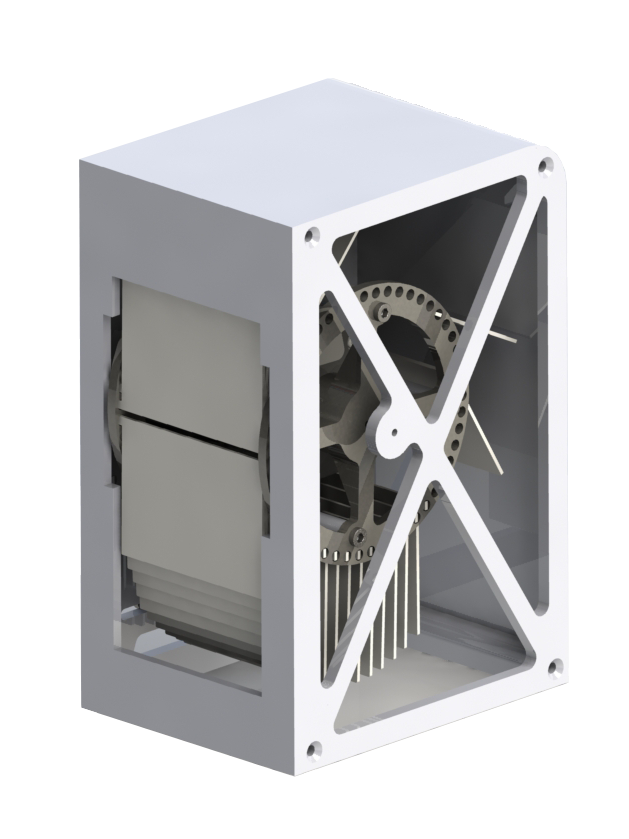
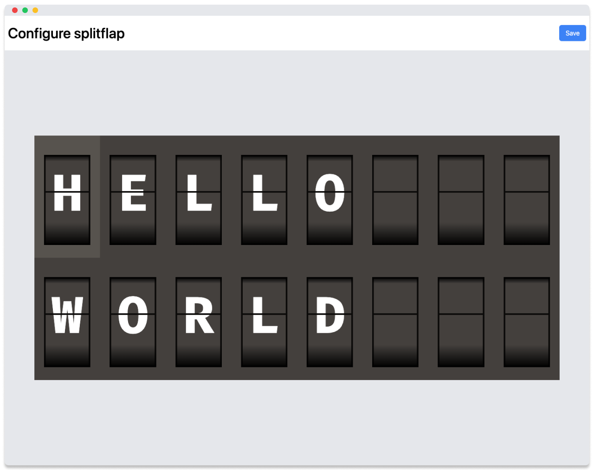

<h1 align="center">SplitFlap</h1>

<p align="center">
  
</p>

<p align="center">A modernized split flap display.</p>

## Features

- 50 Flaps per module
- 54mm x 80mm Character size
- Compact 80mm x 160mm x 110mm module size
- 3D printable
- Daisy chained
- Web controllabe

## Dashboard

The display can be controlled through a web dashboard hosted on the controller module.



## Flap Characters

Suggested 50 characters:

```
A B C D E F G H I J K L M N O P Q R S T U V W X Y Z (26)
1 2 3 4 5 6 7 8 9 0 (10)
blank □ full ■ (2)
? ! + - = * ' : , . @ # % € (14)
```

 <!-- $ & ^ ; -->

> [!NOTE]  
> `0 O` and `1 I` can share the same flap

## Materials

- 1x Nema 17 Stepper Motor
- 1x A4988 Stepper Motor Driver (or similar)
- 1x Hall Effect Switch (a TLE4905L or similar)
- 8x M3 Countersunk Screws (for the body)
- 8x M3 Screws (for the barrel)
- 4x M3x18 Screws (to mount the motor)
- 1x M3 Countersunk Screw (for the flap stopper)

### Micro controller

- Esp32
- Arduino pro micro

I am using an Esp32 for the main module, and you can use any other micro controller like a pro micro for the other modules.

### Motor

I originally got dual shafted Nema 17 motors for this project so I could mount the flap barrel on the back side of the motor.

> [!NOTE]  
> You could use any other Nema 17 motor with a reversed D shaft.
> Reversing the shaft can easily be done if you open up the motor and flip the shaft so it sticks out of the "back" of the motor.
> You might need to tweak the motor spacers and use different length screws to mount different motors.

### Driver

- A4988 Stepper Motor Driver
