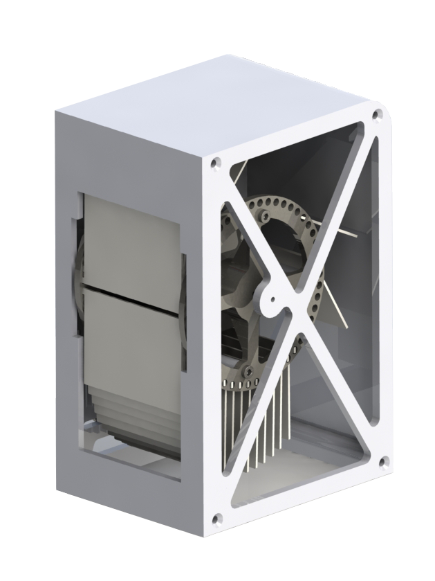

# SplitFlap

A modernized split flap display.

#### Characters

26 `A B C D E F G H I J K L M N O P Q R S T U V W X Y Z` \
10 `1 2 3 4 5 6 7 8 9 0` \
2 `blank □ full ■ ` \
14 `? ! + - = * ' : , . @ # % €/$` <!-- & ^ ; --> \

`0 O` and `1 I` can share the same flap

<!-- 26 + 8 + 2 = 36 -->

## Parts

### Motor

The stepper motor used to turn the barrel is a Dual Shaft Nema 17 with a 20mm front shaft, 10mm back shaft and a body of 42x42x34mm although simelar motor sizes could work as long as they fit inside the barrel and body of a flap module.

A dual shaft motor is used so the mounting holes of the motor are freed and can be more easily used to mount the motor to the side of a module. A motor with a reversed shaft could also work.

### Driver

A4988 Stepper Motor Drivers

### Micro controller

Esp32 / Arduino pro micro
